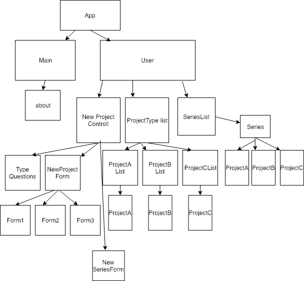
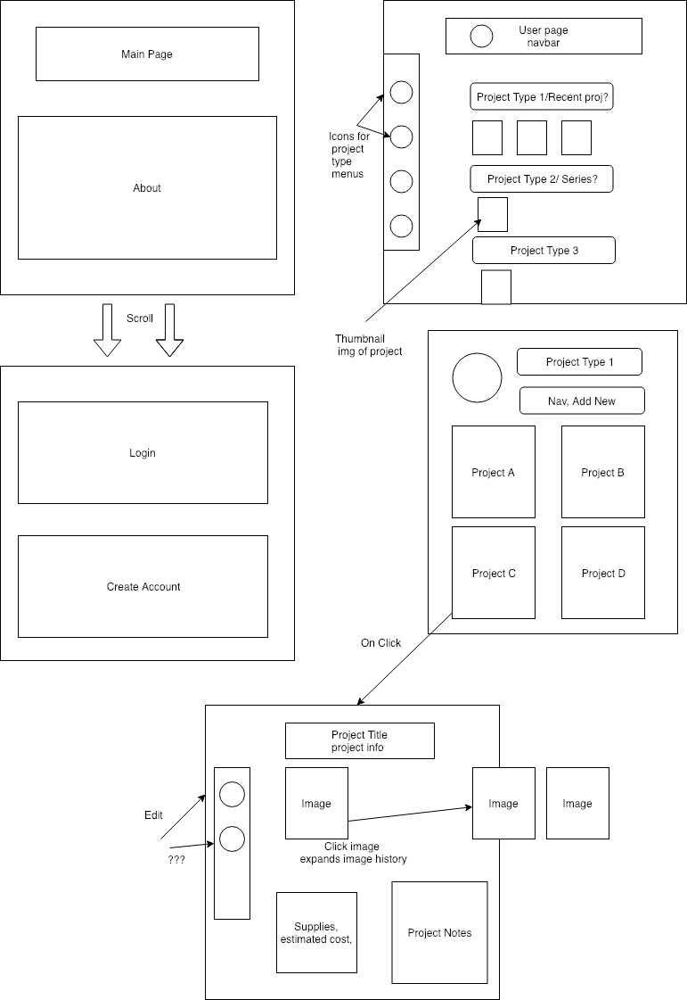

# Capstone Project

#### App for artists/creators to record information about their projects.
#### 03/08/2019

#### By Katrina Hockman

## Description

### MVP:
* App Homepage with about info, login page
* User page to add/view/edit projects
* Separate forms for each category type (painting, sculpture, other)
* Pricing suggestion based on materials cost per piece, time spent on project, set base price, etc

#### MVP Component Tree:

### MVP site layout

### Tools:
 React and Redux will be used.

### Additional Features:
• More categories & forms (Photography, crafts, video, performance, etc)
• Mobile app option to take pictures of receipts, scan QR codes/ barcodes of products
• Connect with other users for collaborations, etc.
• Recording buyer information/ selling platforms
• Record model info
• API ? (supplies brand or store that could be integrated into a search option in the project form.)
• Finished project portfolio view

#### UI State
 * Material UI components for menus, hide & show information
 * Projects will have 'complete' status boolean
 * Redux app state as possible refactor to incorporate firebase (after MVP?)

## Known Bugs

## Setup/Installation Requirements

* Clone repository
* Run npm install from terminal
* Run npm run start from terminal
* Visit localhost:8080 to view

## Technologies Used

Javascript, webpack, CSS, React

### License

This software is licensed under the MIT license.

Copyright (c) 2019 **Katrina Hockman**
